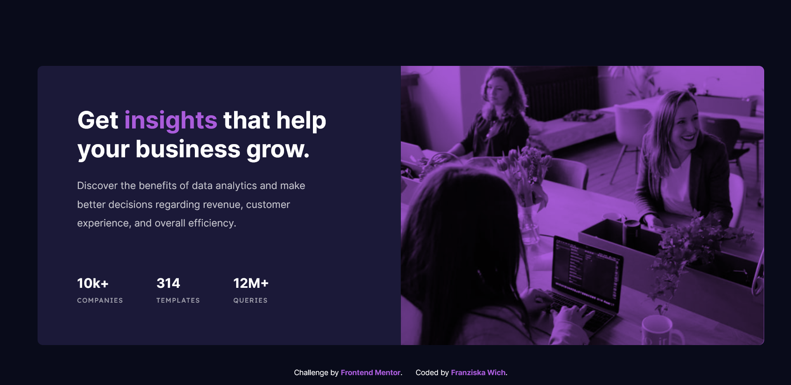

# Stats-preview-card-component

This is a solution to the [Stats preview card component challenge on Frontend Mentor](https://www.frontendmentor.io/challenges/stats-preview-card-component-8JqbgoU62).

## Table of contents

- [Overview](#overview)
  - [The challenge](#the-challenge)
  - [Screenshot](#screenshot)
  - [Links](#links)
- [My process](#my-process)
  - [Built with](#built-with)
  - [What I learned](#what-i-learned)
  - [Continued development](#continued-development)
  - [Useful resources](#useful-resources)
- [Author](#author)


## Overview

### The challenge

Users should be able to:

- View the optimal layout depending on their device's screen size

### Screenshot



### Links

- Solution URL: [https://github.com/franziskawich/stats-preview-card-component/](https://github.com/franziskawich/stats-preview-card-component/)
- Live Site URL: [https://franziskawich.github.io/stats-preview-card-component/](https://franziskawich.github.io/stats-preview-card-component/)

## My process

### Built with

- Semantic HTML5 markup
- SCSS
- Flexbox
- Desktop-first workflow
- BEM methodology

### What I learned

I learned how to include a responsive image with the help of the HTML attributes srcset and sizes; and the "object-fit" property. It seems that "display: block;" on an image is always a good choice to avoid unwanted space next to an image. I found out about the "mix-blend-mode" property and I have found an alternative for IE with the at-rule "@supports not". I had fun commenting and helping another user with this project and I have learned a lot while looking at solutions from other users.

```css
 @supports (mix-blend-mode: multiply) {
      mix-blend-mode: multiply;
    }
```

### Continued development

I should look up ways to test my projects on older IE browsers. Next time I would like to try a mobile-first workflow. The sizes of the images confused me a bit. The desktop version is smaller than the mobile version. I will ask about this when I upload my solution to Frontend Mentors. I am not sure whether I named my classes correctly according to the BEM methodology. I don't think my autoprefixer worked correctly. It only included "-o-object-fit", there should be more prefixes. 

### Useful resources

- [MDN - Responsive images](https://developer.mozilla.org/en-US/docs/Learn/HTML/Multimedia_and_embedding/Responsive_images) - This helped me with including the image. Definitly not the last time I used this resource.
- [Create Your First Github Project in VSCode](https://www.jcchouinard.com/create-your-first-github-project-in-vscode/) - Now I know how to commit and push changes via VSCode and why I need .gitignore files. 

## Author

- Frontend Mentor - [@franziskawich](https://www.frontendmentor.io/profile/franziskawich)
- freeCodeCamp - [Franziska Wich](https://www.freecodecamp.org/fcc35fab9df-6b8c-445e-8aec-36ee00e99ba0)


